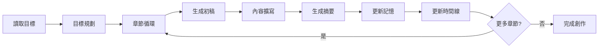

# 🤖 AI 小說家寫作流水線

一個基於 OpenAI GPT-4 的全自動化小說創作系統，採用多代理協作架構，能夠從故事目標自動生成完整的多章節小說。

## ✨ 核心功能

- 🎯 **智能目標規劃** - 將主要故事目標拆解為章節級子目標
- ✍️ **上下文感知寫作** - 整合角色記憶、世界觀、前情提要的章節生成
- 📝 **智能內容擴寫** - 自動優化和豐富章節內容
- 📋 **自動摘要生成** - 為每章生成結構化摘要
- 🧠 **角色記憶管理** - 追蹤和更新角色發展軌跡
- 📅 **劇情時間線** - 自動維護故事進展概覽
- 🔄 **完全自動化** - 一鍵從構思到成書

## 🏗️ 系統架構

```
write_ai_agent/
├── 📁 agents/          # 代理層 - 核心業務邏輯
│   ├── goal_planner_agent.py      # 目標規劃代理
│   ├── chapter_generator.py       # 章節生成代理
│   ├── expansion_agent.py         # 內容擴寫代理
│   └── summarizer_agent.py        # 摘要生成代理
├── 📁 common/          # 通用層 - 配置和工具
│   ├── settings.py               # 中央配置管理
│   └── utils.py                  # 共享工具函式庫
├── 📁 outputs/         # 輸出層 - 生成的章節內容
├── 📁 summaries/       # 摘要層 - 章節摘要
├── 📁 characters/      # 角色層 - 角色設定檔案
├── 📄 main.py          # 系統入口 - 主流程控制
├── 📄 world_setting.yaml         # 世界觀設定
├── 📄 main_goal.yaml            # 主要故事目標
└── 📄 main_character.yaml       # 主角設定
```

## 🔧 技術特點

### 設計模式
- **代理模式** - 多個專職 AI 代理協作
- **管道模式** - 順序執行的寫作流水線
- **工廠模式** - 統一的代理管理
- **配置中心** - 集中化參數控制

### 技術棧
- **Python 3.x** - 核心開發語言
- **OpenAI GPT-4** - AI 內容生成引擎
- **PyYAML** - 配置文件管理
- **python-dotenv** - 環境變數管理

## 🚀 快速開始

### 1. 環境準備

```bash
# 克隆專案
git clone <repository-url>
cd write_ai_agent

# 安裝依賴
pip install openai pyyaml python-dotenv

# 設置環境變數
echo "OPENAI_API_KEY=your_api_key_here" > .env
```

### 2. 配置設定

編輯核心配置檔案：

**main_goal.yaml** - 設定故事主目標
```yaml
main_goal: "主角需要在神秘的古老圖書館中找到失落的魔法書籍，以拯救即將消失的家鄉"
```

**world_setting.yaml** - 定義世界觀
```yaml
continent: 艾爾特大陸
eras: 第五紀元
geography:
  - 阿羅恩村
  - 星環之塔
  - 絕境深淵
magic_system:
  source: 以靈脈為基礎，分五系：元素、精神、轉化、召喚、禁咒
  rules:
    - 魔力來自大地與星辰交會的節點
    - 使用魔法會削弱生命精華，需休養或借助靈晶恢復
```

**main_character.yaml** - 設定主角
```yaml
name: 伊澤
age: 22
background: 年輕的魔導學徒
personality: 好奇心強、勇敢、對知識有強烈渴望
goal: 尋找失踪的父親並掌握禁咒
```

### 3. 執行創作

```bash
# 啟動 AI 小說家寫作流水線
python main.py
```

### 4. 查看結果

執行完成後，檢查以下目錄：
- `outputs/` - 包含 `chapter_XX_draft.md`（初稿）和 `chapter_XX_final.md`（最終版）
- `summaries/` - 包含 `chapter_XX_summary.md`（章節摘要）
- `timeline.md` - 完整的劇情時間線

## 📋 工作流程



## 🤖 代理系統

### 🎯 目標規劃代理 (GoalPlannerAgent)
- **職責**: 將主要故事目標拆解為 3-6 個章節級子目標
- **輸入**: 主要故事目標 + 故事背景
- **輸出**: 結構化的子目標列表

### ✍️ 章節生成代理 (ChapterGeneratorAgent)
- **職責**: 生成具有豐富上下文的章節內容
- **特色**: 整合前情提要、角色記憶、世界觀設定
- **輸出**: 約 800 字的章節初稿

### 📝 擴寫代理 (ExpansionAgent)
- **職責**: 分析並優化章節內容
- **功能**: 提供改善建議 + 重寫為完整版本
- **目標**: 達到 2000+ 字的精緻內容

### 📋 摘要代理 (SummarizerAgent)
- **職責**: 生成章節摘要
- **格式**: 三件重要事件 + 主角心理變化
- **用途**: 為後續章節提供前情提要

## 🔧 核心函數

### 系統入口
- `main_workflow()` - 主流程控制器

### 代理核心
- `GoalPlannerAgent.run()` - 目標規劃執行
- `ChapterGeneratorAgent.run()` - 章節生成執行
- `ExpansionAgent.run()` - 內容擴寫執行
- `SummarizerAgent.run()` - 摘要生成執行

### 工具函式
- `utils.load_yaml()` / `utils.save_yaml()` - 配置管理
- `utils.load_text()` / `utils.save_text()` - 文件操作
- `utils.update_timeline()` - 時間線維護
- `utils.tool_get_main_character()` - 角色獲取

## 📊 輸出示例

### 目標規劃結果
```
🎯 子目標建議：
- 1. 主角到達圖書館並獲取圖書管理員的信任，以便進入特殊藏書區
- 2. 主角在藏書區遭遇一位神秘的競爭者，必須巧妙應對以保持尋書的優勢
- 3. 主角解開藏書區一個古老謎題，成功發現隱藏的秘密通道
- 4. 主角在秘密通道中找到指向失落魔法書籍的線索，但遭遇陷阱和試煉
- 5. 主角與競爭者達成暫時的合作，共同克服最後的障礙，並最終發現失落的魔法書籍
```

### 章節生成示例
```markdown
# 第一章

伊澤站在圖書館的巨大銅門前，神秘的浮雕與古老的符文彷彿低語著古代的秘密。
他深呼吸一口冷空氣，穩定了心神，然後推開了門。一股濃郁的書香迎面而來，
讓他不禁感到一絲寧靜。這裡藏著他尋找父親失踪真相的線索，也許，這裡的古籍
能夠揭開禁咒的秘密...
```

## ⚙️ 配置選項

### 模型配置 (common/settings.py)
```python
PLANNING_MODEL = "gpt-4-turbo"     # 規劃模型
GENERATION_MODEL = "gpt-4-turbo"   # 生成模型  
EXPANSION_MODEL = "gpt-4-turbo"    # 擴寫模型
SUMMARY_MODEL = "gpt-4-turbo"      # 摘要模型
```

### 文件路徑配置
```python
OUTPUTS_DIR = "outputs"            # 章節輸出目錄
SUMMARIES_DIR = "summaries"        # 摘要輸出目錄
CHARACTERS_DIR = "characters"       # 角色設定目錄
WORLD_SETTING_FILE = "world_setting.yaml"
MAIN_CHARACTER_FILE = "main_character.yaml"
```

## 🛠️ 自定義擴展

### 添加新代理
```python
# 1. 創建代理類
class CustomAgent:
    def __init__(self):
        self.client = settings.CLIENT
        self.model = settings.CUSTOM_MODEL
    
    def run(self, input_data):
        # 自定義邏輯
        return result

# 2. 在 main.py 中整合
custom_agent = CustomAgent()
result = custom_agent.run(data)
```

### 添加新工具函式
```python
# 在 common/utils.py 中添加
def custom_utility_function(params):
    """自定義工具函式"""
    # 實現邏輯
    return result
```

## 🧪 測試運行

執行完整測試：
```bash
# 清理舊文件
rm -f outputs/chapter_*.md summaries/chapter_*.md

# 運行完整流水線
python main.py

# 檢查結果
ls outputs/     # 查看生成的章節
ls summaries/   # 查看摘要文件
cat timeline.md # 查看劇情時間線
```

## 📈 性能指標

- **章節生成速度**: ~2-3分鐘/章 (視內容複雜度)
- **內容質量**: 高度連貫的多章節故事
- **自動化程度**: 95%+ (僅需配置初始設定)
- **可擴展性**: 支持任意數量的章節

## 🤝 貢獻指南

1. Fork 本專案
2. 創建功能分支 (`git checkout -b feature/AmazingFeature`)
3. 提交更改 (`git commit -m 'Add some AmazingFeature'`)
4. 推送到分支 (`git push origin feature/AmazingFeature`)
5. 開啟 Pull Request

## 📝 更新日誌

### v2.0.0 (最新)
- ✅ 完全重構為代理架構
- ✅ 統一配置管理系統
- ✅ 自動化角色記憶管理
- ✅ 智能時間線維護
- ✅ 模組化設計

### v1.x
- 基礎章節生成功能
- 簡單的內容擴寫

## 📄 許可證

本專案採用 MIT 許可證 - 詳見 [LICENSE](LICENSE) 文件

## 🆘 常見問題

**Q: 如何更改生成的章節數量？**
A: 修改目標規劃的提示詞，要求生成更多或更少的子目標。

**Q: 可以使用其他 AI 模型嗎？**
A: 是的，在 `common/settings.py` 中修改模型配置。

**Q: 如何自定義寫作風格？**
A: 在各代理的 `_build_prompt()` 方法中修改寫作指令。

**Q: 支援多語言嗎？**
A: 目前主要支援中文，可透過修改提示詞支援其他語言。

---

## 🌟 如果這個專案對您有幫助，請給個 Star！

**讓 AI 成為您的創作夥伴，開啟無限的故事可能！** ✨📚🤖